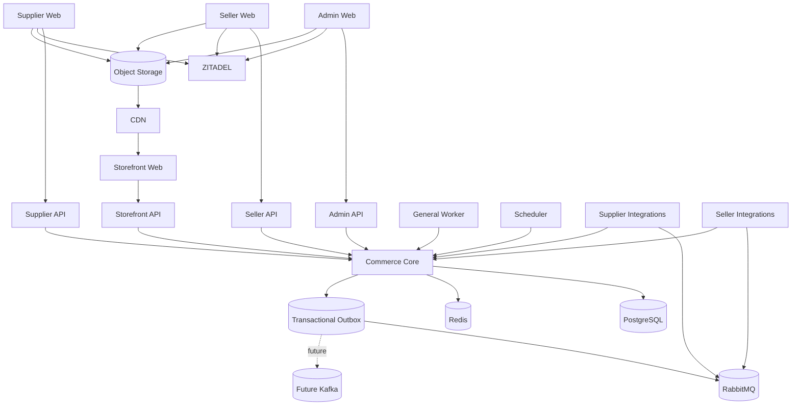
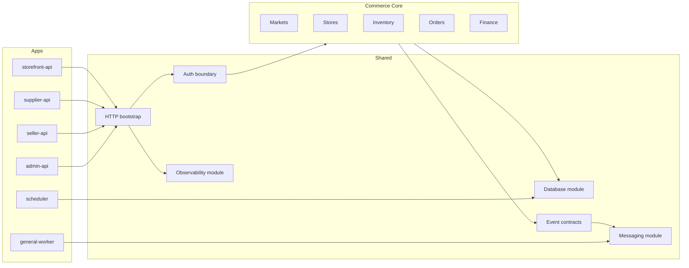
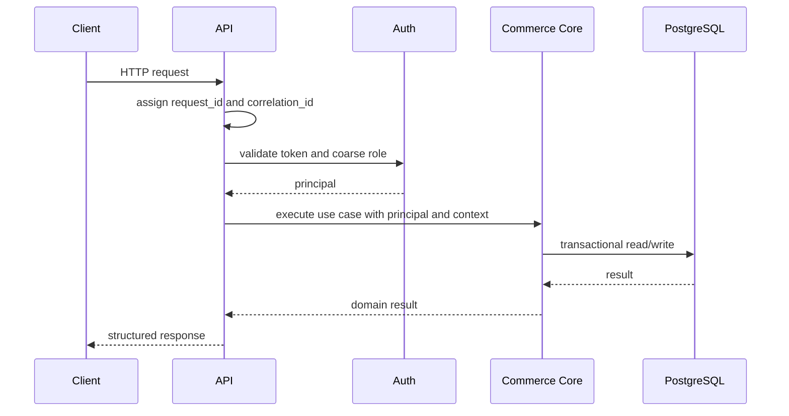
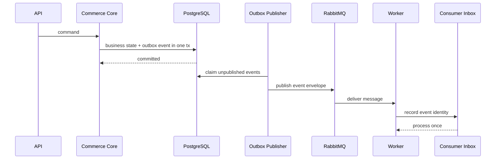
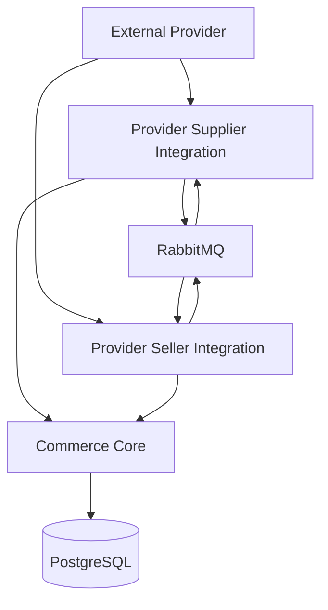
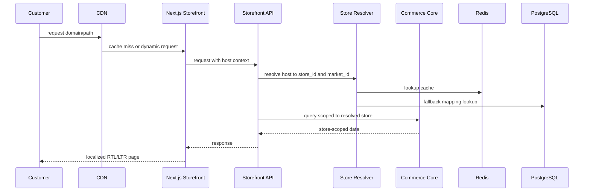

# Distributed Commerce Platform Architecture Plan

This plan translates `docs/plans/master-plan.md` into the concrete Phase 0 architecture. The Master Plan remains the roadmap and source of business scope.

## Grilling Outcome

Phase 0 has no unresolved architecture blocker. The foundation will be a monorepo with independently buildable applications, a shared Commerce Core, infrastructure seams for PostgreSQL, Redis, RabbitMQ, ZITADEL, and OpenTelemetry, and no Kafka runtime dependency.

Required now:

- Root Go module with independently buildable app entrypoints.
- Thin actor-facing APIs that call shared Commerce Core modules.
- PostgreSQL migrations, connection pooling, and transaction helper.
- RabbitMQ-compatible message/event envelopes and publisher/consumer seams.
- Transactional outbox and consumer inbox schema.
- React/Next.js frontend foundations with Arabic/English and RTL/LTR.
- Local Docker Compose for PostgreSQL, Redis, RabbitMQ, and ZITADEL.
- CI checks for Go, frontend, migrations, Docker, dependency, and secret hygiene.

Prepared now, implemented later:

- Kafka-compatible event contracts.
- Double-entry ledger invariant.
- Storefront tenant resolution contract.
- Theme safety model.
- Strong inventory reservation strategy.

Postponed intentionally:

- Kafka deployment.
- Kubernetes, service mesh, sharding, distributed SQL, CQRS, and event sourcing.
- Commerce features such as products, orders, checkout, payments, shipping, settlements, and integrations.

## System Context



## Application Boundaries

`admin-api`, `seller-api`, `supplier-api`, and `storefront-api` are actor-facing API applications. They own transport, authentication entrypoints, request validation, response shaping, and actor-specific policy checks. They must not duplicate Commerce Core business rules, and they must not call each other to execute commerce workflows.

Commerce Core owns commercial truth and business invariants for markets, sellers, suppliers, stores, catalog, listings, inventory, orders, payments, fulfillment, returns, finance, and events. Actor APIs invoke Commerce Core application/domain modules directly.

`general-worker` executes asynchronous jobs, outbox publication, notifications, cache invalidation, webhook delivery, and other background commands. `scheduler` triggers time-based work such as reconciliation, reservation expiry, settlement cycles, cleanup, and periodic sync.

Supplier and seller integrations are independent applications. A provider can have both `salla-supplier-integration` and `salla-seller-integration`, but they are separately deployable, scalable, versioned, testable, observable, and releasable. There is no mandatory central Salla, Shopify, or WooCommerce runtime service.

## Service Architecture



## Request Flow



## Order and Outbox Async Flow

This is the required later pattern; Phase 0 only installs the foundation.



## Integration Flow



Each integration owns integration state only: connections, mappings, cursors, webhook inboxes, sync jobs, reconciliation state, and provider metadata. Commerce Core remains authoritative for products, listings, inventory, orders, payments, balances, and settlements.

## Storefront Request Flow



## Critical Invariants

- PostgreSQL is the transactional source of truth.
- Redis is never authoritative for orders, inventory, payments, balances, or settlements.
- RabbitMQ handles commands, jobs, retries, and work queues.
- Kafka is a future domain-event backbone and is introduced only when replay, fan-out, analytics, or ecosystem requirements justify it.
- Important state changes and outgoing events are persisted transactionally.
- Important event consumers support idempotent processing by event identity.
- Inventory reservation is strongly consistent.
- Inventory belongs conceptually to SKU plus Fulfillment Location.
- Fulfillment Location is a first-class domain concept.
- Store Market equals Seller Listing Market equals Supplier Offer Market and must be enforced in domain logic and database constraints.
- Money never uses floating point. Monetary values use deterministic minor-unit or explicit decimal representation.
- Order items preserve immutable commercial snapshots.
- Financial truth eventually uses an immutable double-entry ledger.
- External integration state is eventually consistent and reconciled.
- Webhooks follow verify, persist, deduplicate, respond quickly, process asynchronously, reconcile.
- Arabic and English are first-class languages with RTL/LTR support.
- Each Seller Store belongs to exactly one Market.
- Cross-border supplier sourcing is unsupported initially.
- Seller stores support multiple platform-controlled themes. Arbitrary seller-provided executable JavaScript is not supported initially.

## Repository Structure

```text
apps/
  admin-api/
  seller-api/
  supplier-api/
  storefront-api/
  workers/
    general-worker/
    scheduler/
  integrations/
    suppliers/
    sellers/
internal/
  markets/
  sellers/
  suppliers/
  stores/
  catalog/
  listings/
  inventory/
  orders/
  payments/
  fulfillment/
  returns/
  finance/
  events/
packages/
  auth/
  config/
  contracts/
  database/
  events/
  httpx/
  inbox/
  logging/
  messaging/
  observability/
  outbox/
web/
  admin/
  seller/
  supplier/
  storefront/
migrations/
docs/
```

## Phase 0 Technology Defaults

- Go: one root module, independently buildable commands.
- HTTP: `net/http` with `chi`.
- Database: PostgreSQL via `pgxpool`.
- Migrations: `golang-migrate`.
- Logging: standard `log/slog` JSON logs.
- Validation: `go-playground/validator`.
- Messaging: RabbitMQ via `amqp091-go` behind package-level seams.
- Observability: OpenTelemetry-compatible trace and metric initialization.
- Frontend: Vite React for management apps, Next.js for storefront, TypeScript everywhere.
- Local infra: Docker Compose for PostgreSQL, Redis, RabbitMQ, and ZITADEL.
